# AgentScope 深度架构分析报告

> **项目**: AgentScope — 面向生产环境的多智能体框架
> **作者**: 阿里巴巴通义实验室 SysML 团队
> **许可证**: Apache-2.0
> **Python**: ≥ 3.10
> **论文**: [arXiv:2402.14034](https://arxiv.org/abs/2402.14034)

---

## 目录

1. [项目概览与设计哲学](#1-项目概览与设计哲学)
2. [整体架构全景图](#2-整体架构全景图)
3. [核心基础层](#3-核心基础层)
4. [消息系统 (Message)](#4-消息系统-message)
5. [Agent 框架](#5-agent-框架)
6. [模型集成层 (Model)](#6-模型集成层-model)
7. [格式化器 (Formatter)](#7-格式化器-formatter)
8. [记忆系统 (Memory)](#8-记忆系统-memory)
9. [工具与技能系统 (Tool & Skill)](#9-工具与技能系统-tool--skill)
10. [Pipeline 与多智能体编排](#10-pipeline-与多智能体编排)
11. [RAG 检索增强生成](#11-rag-检索增强生成)
12. [实时语音交互 (Realtime)](#12-实时语音交互-realtime)
13. [TTS 语音合成](#13-tts-语音合成)
14. [A2A 协议支持](#14-a2a-协议支持)
15. [规划系统 (Plan)](#15-规划系统-plan)
16. [评估框架 (Evaluate)](#16-评估框架-evaluate)
17. [模型微调 (Tuner)](#17-模型微调-tuner)
18. [会话与状态管理 (Session & State)](#18-会话与状态管理-session--state)
19. [可观测性与追踪 (Tracing)](#19-可观测性与追踪-tracing)
20. [Embedding 向量化](#20-embedding-向量化)
21. [关键设计模式总结](#21-关键设计模式总结)
22. [学习路径与掌握指南](#22-学习路径与掌握指南)
23. [面试准备指南](#23-面试准备指南)

---

## 1. 项目概览与设计哲学

AgentScope 是一个面向生产环境的、易用的多智能体框架，核心设计理念是：

- **为日益强大的 Agentic LLM 而设计**：利用模型自身的推理和工具使用能力，而非用严格的 prompt 和固定编排来约束它们
- **简单**：5 分钟内即可构建 Agent，内置 ReAct Agent、工具、技能、人机协作、记忆、规划、实时语音、评估和模型微调
- **可扩展**：大量生态集成（工具、记忆、可观测性），内置 MCP 和 A2A 协议支持
- **生产就绪**：支持本地部署、云端 Serverless、K8s 集群，内置 OpenTelemetry 支持

### 项目规模

| 维度 | 数据 |
|------|------|
| 核心模块数 | 25+ 个子包 |
| Agent 类型 | 5 种（Base, ReAct, User, A2A, Realtime） |
| 模型适配器 | 6 种（OpenAI, DashScope, Gemini, Anthropic, Ollama, Trinity） |
| 记忆后端 | 5 种（InMemory, Redis, SQLAlchemy, TableStore, Mem0/ReMe） |
| 向量数据库 | 5 种（Qdrant, Milvus, MongoDB, MySQL, OceanBase） |
| 示例项目 | 30+ 个 |

---

## 2. 整体架构全景图

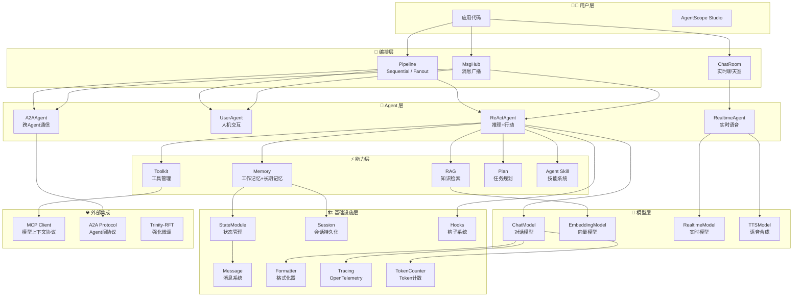
```mermaid
graph TB
    subgraph 用户层["🧑‍💻 用户层"]
        APP[应用代码]
        STUDIO[AgentScope Studio]
    end

    subgraph 编排层["🔀 编排层"]
        PIPE[Pipeline<br/>Sequential / Fanout]
        MSGHUB[MsgHub<br/>消息广播]
        CHATROOM[ChatRoom<br/>实时聊天室]
    end

    subgraph Agent层["🤖 Agent 层"]
        REACT[ReActAgent<br/>推理+行动]
        USER[UserAgent<br/>人机交互]
        A2A_AG[A2AAgent<br/>跨Agent通信]
        RT_AG[RealtimeAgent<br/>实时语音]
    end

    subgraph 能力层["⚡ 能力层"]
        TOOL[Toolkit<br/>工具管理]
        MEM[Memory<br/>工作记忆+长期记忆]
        RAG_M[RAG<br/>知识检索]
        PLAN[Plan<br/>任务规划]
        SKILL[Agent Skill<br/>技能系统]
    end

    subgraph 模型层["🧠 模型层"]
        CHAT[ChatModel<br/>对话模型]
        EMB[EmbeddingModel<br/>向量模型]
        RT_MODEL[RealtimeModel<br/>实时模型]
        TTS_M[TTSModel<br/>语音合成]
    end

    subgraph 基础设施层["🏗️ 基础设施层"]
        MSG[Message<br/>消息系统]
        FMT[Formatter<br/>格式化器]
        STATE[StateModule<br/>状态管理]
        SESSION[Session<br/>会话持久化]
        TRACE[Tracing<br/>OpenTelemetry]
        TOKEN[TokenCounter<br/>Token计数]
        HOOK[Hooks<br/>钩子系统]
    end

    subgraph 外部集成["🌐 外部集成"]
        MCP_C[MCP Client<br/>模型上下文协议]
        A2A_P[A2A Protocol<br/>Agent间协议]
        TRINITY[Trinity-RFT<br/>强化微调]
    end

    APP --> PIPE & MSGHUB & CHATROOM
    PIPE & MSGHUB --> REACT & USER & A2A_AG
    CHATROOM --> RT_AG
    REACT --> TOOL & MEM & RAG_M & PLAN & SKILL
    REACT --> CHAT
    RT_AG --> RT_MODEL & TTS_M
    A2A_AG --> A2A_P
    TOOL --> MCP_C
    CHAT --> FMT
    MEM --> STATE & SESSION
    RAG_M --> EMB
    REACT --> HOOK
    CHAT --> TRACE & TOKEN
    STATE --> MSG
```

### 模块依赖关系图

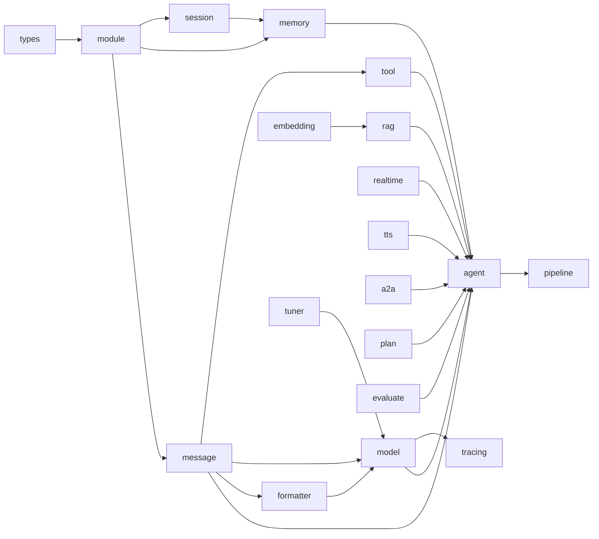
```mermaid
graph LR
    types[types] --> module[module]
    module --> message[message]
    message --> agent[agent]
    message --> formatter[formatter]
    message --> model[model]
    message --> tool[tool]
    agent --> pipeline[pipeline]
    model --> agent
    formatter --> model
    module --> memory[memory]
    memory --> agent
    tool --> agent
    embedding[embedding] --> rag[rag]
    rag --> agent
    model --> tracing[tracing]
    module --> session[session]
    session --> memory
    realtime[realtime] --> agent
    tts[tts] --> agent
    a2a[a2a] --> agent
    plan[plan] --> agent
    evaluate[evaluate] --> agent
    tuner[tuner] --> model
```

---

## 3. 核心基础层

### 3.1 StateModule — 状态管理基石

`StateModule` 是整个框架的状态管理基石，类似于 PyTorch 的 `nn.Module`，支持嵌套的状态序列化与反序列化。

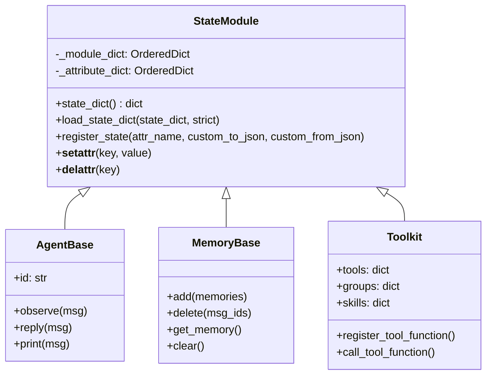
```mermaid
classDiagram
    class StateModule {
        -_module_dict: OrderedDict
        -_attribute_dict: OrderedDict
        +state_dict() dict
        +load_state_dict(state_dict, strict)
        +register_state(attr_name, custom_to_json, custom_from_json)
        +__setattr__(key, value)
        +__delattr__(key)
    }

    class AgentBase {
        +id: str
        +observe(msg)
        +reply(msg)
        +print(msg)
    }

    class MemoryBase {
        +add(memories)
        +delete(msg_ids)
        +get_memory()
        +clear()
    }

    class Toolkit {
        +tools: dict
        +groups: dict
        +skills: dict
        +register_tool_function()
        +call_tool_function()
    }

    StateModule <|-- AgentBase
    StateModule <|-- MemoryBase
    StateModule <|-- Toolkit
```

**核心机制**：
- 当设置属性为 `StateModule` 子类时，自动注册到 `_module_dict`，实现嵌套状态追踪
- `register_state()` 方法注册需要序列化的普通属性，支持自定义 JSON 序列化函数
- `state_dict()` 递归收集所有嵌套模块和注册属性的状态
- `load_state_dict()` 递归恢复状态，支持 strict 模式

### 3.2 全局配置 (_ConfigCls)

使用 Python `ContextVar` 实现线程安全和异步安全的全局配置：

```python
# 核心配置项
_config = _ConfigCls(
    run_id=ContextVar("run_id"),        # 运行唯一标识
    project=ContextVar("project"),       # 项目名称
    name=ContextVar("name"),             # 运行名称
    created_at=ContextVar("created_at"), # 创建时间
    trace_enabled=ContextVar("trace_enabled"),  # 追踪开关
)
```

**设计亮点**：使用 `ContextVar` 而非全局变量，确保在多线程和异步场景下的隔离性。

### 3.3 异常体系

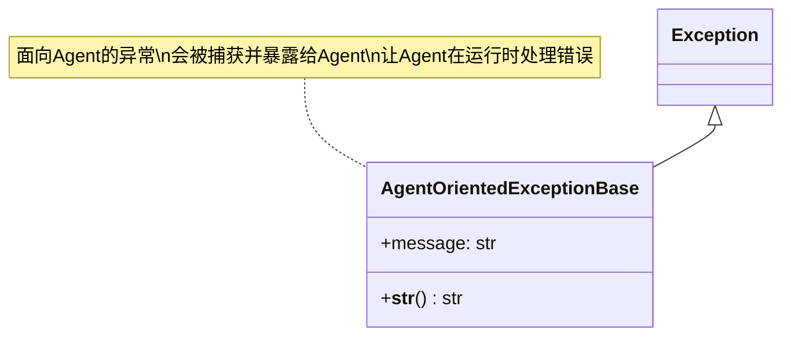
```mermaid
classDiagram
    class AgentOrientedExceptionBase {
        +message: str
        +__str__() str
    }
    Exception <|-- AgentOrientedExceptionBase
    note for AgentOrientedExceptionBase "面向Agent的异常\n会被捕获并暴露给Agent\n让Agent在运行时处理错误"
```

### 3.4 Hook 类型系统

```python
# 基础 Agent Hook 类型
AgentHookTypes = "pre_reply" | "post_reply" | "pre_print" | "post_print" 
                 | "pre_observe" | "post_observe"

# ReAct Agent 扩展 Hook 类型
ReActAgentHookTypes = AgentHookTypes 
                      | "pre_reasoning" | "post_reasoning" 
                      | "pre_acting" | "post_acting"
```

---

## 4. 消息系统 (Message)

### 4.1 Msg 类 — 统一消息抽象

`Msg` 是整个框架的通信基础单元，所有 Agent 间的交互都通过 `Msg` 进行。

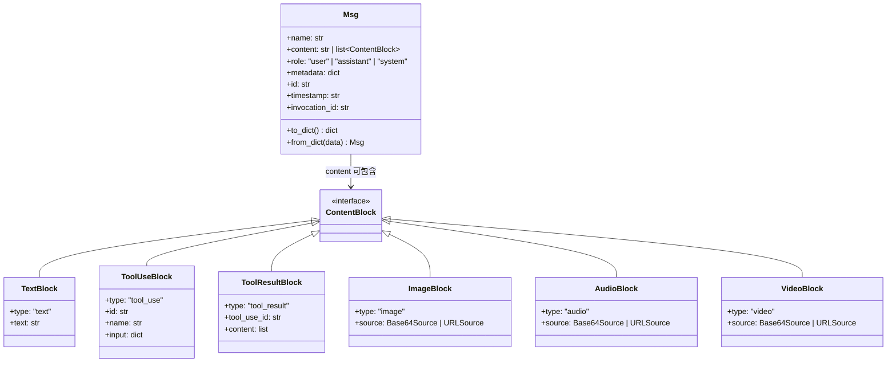
```mermaid
classDiagram
    class Msg {
        +name: str
        +content: str | list~ContentBlock~
        +role: "user" | "assistant" | "system"
        +metadata: dict
        +id: str
        +timestamp: str
        +invocation_id: str
        +to_dict() dict
        +from_dict(data) Msg
    }

    class ContentBlock {
        <<interface>>
    }

    class TextBlock {
        +type: "text"
        +text: str
    }

    class ToolUseBlock {
        +type: "tool_use"
        +id: str
        +name: str
        +input: dict
    }

    class ToolResultBlock {
        +type: "tool_result"
        +tool_use_id: str
        +content: list
    }

    class ImageBlock {
        +type: "image"
        +source: Base64Source | URLSource
    }

    class AudioBlock {
        +type: "audio"
        +source: Base64Source | URLSource
    }

    class VideoBlock {
        +type: "video"
        +source: Base64Source | URLSource
    }

    ContentBlock <|-- TextBlock
    ContentBlock <|-- ToolUseBlock
    ContentBlock <|-- ToolResultBlock
    ContentBlock <|-- ImageBlock
    ContentBlock <|-- AudioBlock
    ContentBlock <|-- VideoBlock
    Msg --> ContentBlock : content 可包含
```

**设计要点**：
- `content` 支持纯字符串和结构化内容块两种形式，兼顾简单场景和多模态场景
- 多模态支持：图片、音频、视频均通过 Base64 或 URL 引用
- 工具调用通过 `ToolUseBlock` 和 `ToolResultBlock` 实现完整的调用-结果闭环
- 每条消息有唯一 `id`（shortuuid）和时间戳，支持追踪和排序

---

## 5. Agent 框架

### 5.1 Agent 继承体系

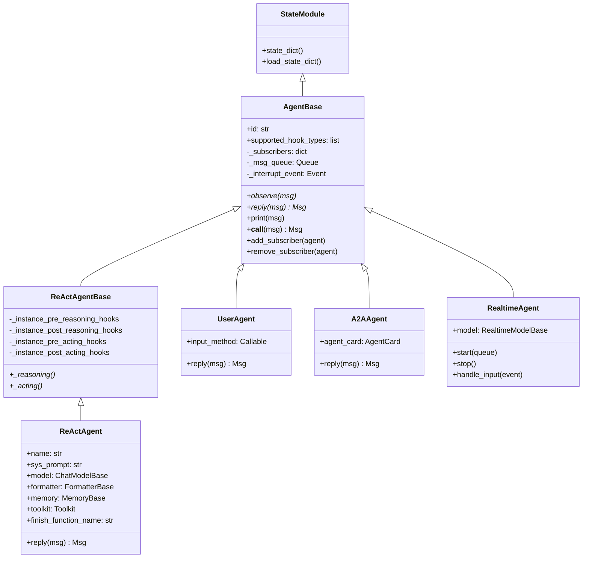
```mermaid
classDiagram
    class StateModule {
        +state_dict()
        +load_state_dict()
    }

    class AgentBase {
        +id: str
        +supported_hook_types: list
        +observe(msg)*
        +reply(msg)* Msg
        +print(msg)
        +__call__(msg) Msg
        -_subscribers: dict
        -_msg_queue: Queue
        -_interrupt_event: Event
        +add_subscriber(agent)
        +remove_subscriber(agent)
    }

    class ReActAgentBase {
        +_reasoning()*
        +_acting()*
        -_instance_pre_reasoning_hooks
        -_instance_post_reasoning_hooks
        -_instance_pre_acting_hooks
        -_instance_post_acting_hooks
    }

    class ReActAgent {
        +name: str
        +sys_prompt: str
        +model: ChatModelBase
        +formatter: FormatterBase
        +memory: MemoryBase
        +toolkit: Toolkit
        +finish_function_name: str
        +reply(msg) Msg
    }

    class UserAgent {
        +input_method: Callable
        +reply(msg) Msg
    }

    class A2AAgent {
        +agent_card: AgentCard
        +reply(msg) Msg
    }

    class RealtimeAgent {
        +model: RealtimeModelBase
        +start(queue)
        +stop()
        +handle_input(event)
    }

    StateModule <|-- AgentBase
    AgentBase <|-- ReActAgentBase
    AgentBase <|-- UserAgent
    AgentBase <|-- A2AAgent
    ReActAgentBase <|-- ReActAgent
    AgentBase <|-- RealtimeAgent
```

### 5.2 Agent 生命周期与 Hook 系统

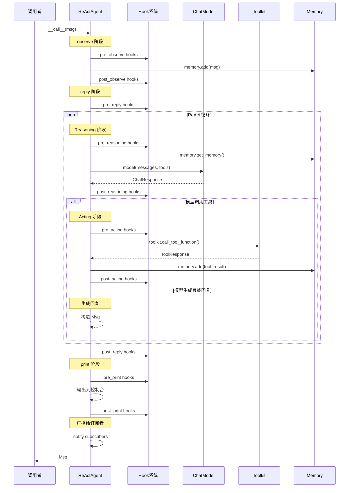
```mermaid
sequenceDiagram
    participant Caller as 调用者
    participant Agent as ReActAgent
    participant Hook as Hook系统
    participant Model as ChatModel
    participant Tool as Toolkit
    participant Memory as Memory

    Caller->>Agent: __call__(msg)
    
    Note over Agent: observe 阶段
    Agent->>Hook: pre_observe hooks
    Agent->>Memory: memory.add(msg)
    Agent->>Hook: post_observe hooks
    
    Note over Agent: reply 阶段
    Agent->>Hook: pre_reply hooks
    
    loop ReAct 循环
        Note over Agent: Reasoning 阶段
        Agent->>Hook: pre_reasoning hooks
        Agent->>Memory: memory.get_memory()
        Agent->>Model: model(messages, tools)
        Model-->>Agent: ChatResponse
        Agent->>Hook: post_reasoning hooks
        
        alt 模型调用工具
            Note over Agent: Acting 阶段
            Agent->>Hook: pre_acting hooks
            Agent->>Tool: toolkit.call_tool_function()
            Tool-->>Agent: ToolResponse
            Agent->>Memory: memory.add(tool_result)
            Agent->>Hook: post_acting hooks
        else 模型生成最终回复
            Note over Agent: 生成回复
            Agent-->>Agent: 构造 Msg
        end
    end
    
    Agent->>Hook: post_reply hooks
    
    Note over Agent: print 阶段
    Agent->>Hook: pre_print hooks
    Agent->>Agent: 输出到控制台
    Agent->>Hook: post_print hooks
    
    Note over Agent: 广播给订阅者
    Agent->>Agent: notify subscribers
    
    Agent-->>Caller: Msg
```

### 5.3 Hook 系统详解

AgentScope 的 Hook 系统支持两个层级：

| 层级 | 作用域 | 注册方式 |
|------|--------|----------|
| 类级别 (Class-level) | 影响该类所有实例 | `AgentBase._class_pre_reply_hooks` |
| 实例级别 (Instance-level) | 仅影响单个实例 | `agent._instance_pre_reply_hooks` |

**Hook 执行顺序**：类级别 hooks → 实例级别 hooks

**Hook 签名**：
- `pre_*` hooks: `(self, kwargs) -> kwargs | None` — 可修改输入参数
- `post_*` hooks: `(self, kwargs, output) -> Msg | None` — 可修改输出消息

### 5.4 ReActAgent 核心特性

ReActAgent 是框架中最核心的 Agent 实现，支持：

1. **实时引导 (Realtime Steering)**：通过 `_interrupt_event` 支持人机协作中的实时干预
2. **API 级并行工具调用**：模型可一次返回多个工具调用，并行执行
3. **记忆压缩**：当 token 超过阈值时自动压缩历史记忆
4. **结构化输出**：通过注册 `generate_response` 工具函数实现结构化输出
5. **知识检索**：集成 RAG 知识库检索
6. **长期记忆**：集成 Mem0/ReMe 长期记忆

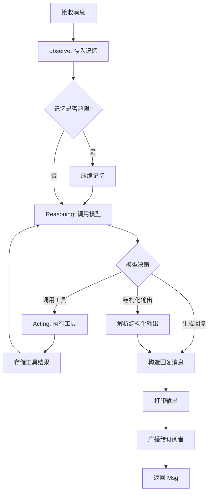
```mermaid
flowchart TD
    START[接收消息] --> OBSERVE[observe: 存入记忆]
    OBSERVE --> COMPRESS{记忆是否超限?}
    COMPRESS -->|是| DO_COMPRESS[压缩记忆]
    DO_COMPRESS --> REASON
    COMPRESS -->|否| REASON[Reasoning: 调用模型]
    REASON --> DECISION{模型决策}
    DECISION -->|调用工具| ACT[Acting: 执行工具]
    ACT --> STORE_RESULT[存储工具结果]
    STORE_RESULT --> REASON
    DECISION -->|生成回复| REPLY[构造回复消息]
    DECISION -->|结构化输出| STRUCT[解析结构化输出]
    STRUCT --> REPLY
    REPLY --> PRINT[打印输出]
    PRINT --> BROADCAST[广播给订阅者]
    BROADCAST --> END[返回 Msg]
```

---

## 6. 模型集成层 (Model)

### 6.1 模型抽象体系

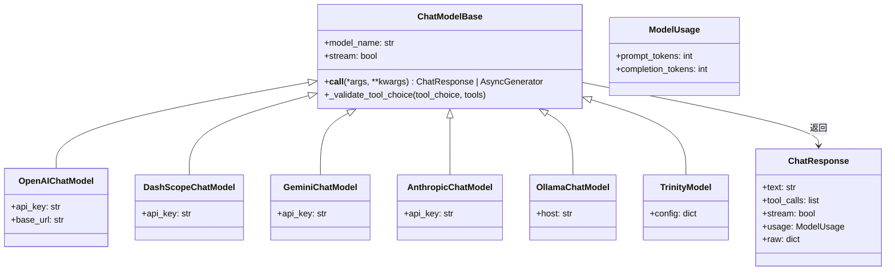
```mermaid
classDiagram
    class ChatModelBase {
        +model_name: str
        +stream: bool
        +__call__(*args, **kwargs) ChatResponse | AsyncGenerator
        +_validate_tool_choice(tool_choice, tools)
    }

    class OpenAIChatModel {
        +api_key: str
        +base_url: str
    }

    class DashScopeChatModel {
        +api_key: str
    }

    class GeminiChatModel {
        +api_key: str
    }

    class AnthropicChatModel {
        +api_key: str
    }

    class OllamaChatModel {
        +host: str
    }

    class TrinityModel {
        +config: dict
    }

    ChatModelBase <|-- OpenAIChatModel
    ChatModelBase <|-- DashScopeChatModel
    ChatModelBase <|-- GeminiChatModel
    ChatModelBase <|-- AnthropicChatModel
    ChatModelBase <|-- OllamaChatModel
    ChatModelBase <|-- TrinityModel

    class ChatResponse {
        +text: str
        +tool_calls: list
        +stream: bool
        +usage: ModelUsage
        +raw: dict
    }

    class ModelUsage {
        +prompt_tokens: int
        +completion_tokens: int
    }

    ChatModelBase --> ChatResponse : 返回
```

### 6.2 模型调用流程

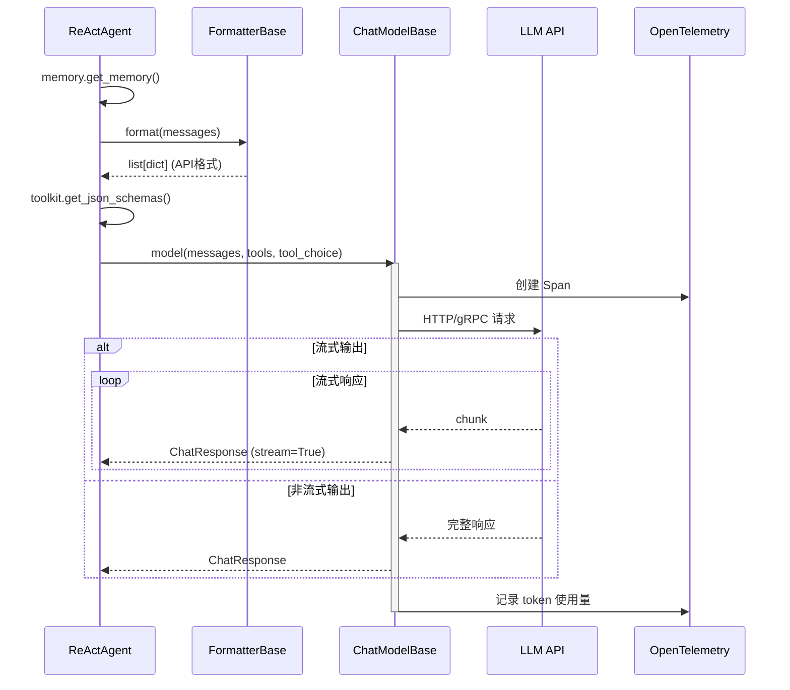
```mermaid
sequenceDiagram
    participant Agent as ReActAgent
    participant Formatter as FormatterBase
    participant Model as ChatModelBase
    participant API as LLM API
    participant Tracer as OpenTelemetry

    Agent->>Agent: memory.get_memory()
    Agent->>Formatter: format(messages)
    Formatter-->>Agent: list[dict] (API格式)
    Agent->>Agent: toolkit.get_json_schemas()
    Agent->>Model: model(messages, tools, tool_choice)
    
    activate Model
    Model->>Tracer: 创建 Span
    Model->>API: HTTP/gRPC 请求
    
    alt 流式输出
        loop 流式响应
            API-->>Model: chunk
            Model-->>Agent: ChatResponse (stream=True)
        end
    else 非流式输出
        API-->>Model: 完整响应
        Model-->>Agent: ChatResponse
    end
    
    Model->>Tracer: 记录 token 使用量
    deactivate Model
```

### 6.3 支持的模型矩阵

| 模型提供商 | 对话模型 | 嵌入模型 | 实时模型 | TTS模型 |
|-----------|---------|---------|---------|---------|
| OpenAI | ✅ | ✅ | ✅ | ✅ |
| DashScope (通义) | ✅ | ✅ (含多模态) | ✅ | ✅ (含CosyVoice) |
| Gemini | ✅ | ✅ | ✅ | ✅ |
| Anthropic | ✅ | ❌ | ❌ | ❌ |
| Ollama | ✅ | ✅ | ❌ | ❌ |
| Trinity-RFT | ✅ | ❌ | ❌ | ❌ |

---

## 7. 格式化器 (Formatter)

Formatter 负责将 AgentScope 的 `Msg` 对象转换为各 LLM API 所需的特定格式。

### 7.1 Formatter 体系

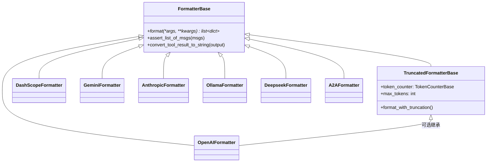
```mermaid
classDiagram
    class FormatterBase {
        +format(*args, **kwargs)* list~dict~
        +assert_list_of_msgs(msgs)
        +convert_tool_result_to_string(output)
    }

    class TruncatedFormatterBase {
        +token_counter: TokenCounterBase
        +max_tokens: int
        +format_with_truncation()
    }

    class OpenAIFormatter
    class DashScopeFormatter
    class GeminiFormatter
    class AnthropicFormatter
    class OllamaFormatter
    class DeepseekFormatter
    class A2AFormatter

    FormatterBase <|-- TruncatedFormatterBase
    FormatterBase <|-- OpenAIFormatter
    FormatterBase <|-- DashScopeFormatter
    FormatterBase <|-- GeminiFormatter
    FormatterBase <|-- AnthropicFormatter
    FormatterBase <|-- OllamaFormatter
    FormatterBase <|-- DeepseekFormatter
    FormatterBase <|-- A2AFormatter
    TruncatedFormatterBase <|-- OpenAIFormatter : 可选继承
```

**关键职责**：
- 将 `Msg.content` 中的多模态内容块转换为各 API 的格式
- 处理工具调用结果的格式差异（有些 API 不支持多模态工具结果）
- `TruncatedFormatterBase` 提供基于 token 计数的消息截断能力

---

## 8. 记忆系统 (Memory)

### 8.1 记忆架构

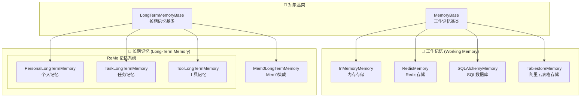
```mermaid
graph TB
    subgraph 工作记忆["🧠 工作记忆 (Working Memory)"]
        IM[InMemoryMemory<br/>内存存储]
        REDIS[RedisMemory<br/>Redis存储]
        SQL[SQLAlchemyMemory<br/>SQL数据库]
        TS[TablestoreMemory<br/>阿里云表格存储]
    end

    subgraph 长期记忆["💾 长期记忆 (Long-Term Memory)"]
        MEM0[Mem0LongTermMemory<br/>Mem0集成]
        subgraph ReMe["ReMe 记忆系统"]
            PERSONAL[PersonalLongTermMemory<br/>个人记忆]
            TASK[TaskLongTermMemory<br/>任务记忆]
            TOOL_M[ToolLongTermMemory<br/>工具记忆]
        end
    end

    subgraph 基类["📐 抽象基类"]
        MB[MemoryBase<br/>工作记忆基类]
        LTM[LongTermMemoryBase<br/>长期记忆基类]
    end

    MB --> IM & REDIS & SQL & TS
    LTM --> MEM0 & PERSONAL & TASK & TOOL_M
```

### 8.2 工作记忆接口

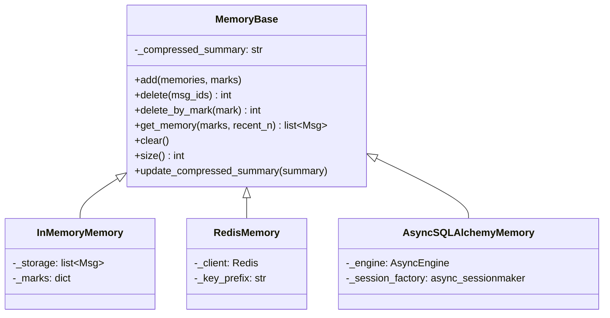
```mermaid
classDiagram
    class MemoryBase {
        -_compressed_summary: str
        +add(memories, marks)
        +delete(msg_ids) int
        +delete_by_mark(mark) int
        +get_memory(marks, recent_n) list~Msg~
        +clear()
        +size() int
        +update_compressed_summary(summary)
    }

    class InMemoryMemory {
        -_storage: list~Msg~
        -_marks: dict
    }

    class RedisMemory {
        -_client: Redis
        -_key_prefix: str
    }

    class AsyncSQLAlchemyMemory {
        -_engine: AsyncEngine
        -_session_factory: async_sessionmaker
    }

    MemoryBase <|-- InMemoryMemory
    MemoryBase <|-- RedisMemory
    MemoryBase <|-- AsyncSQLAlchemyMemory
```

### 8.3 记忆压缩机制

ReActAgent 内置了记忆压缩功能，当 token 数超过阈值时自动触发：

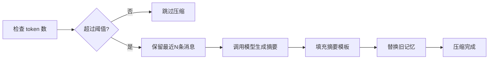
```mermaid
flowchart LR
    CHECK[检查 token 数] --> THRESHOLD{超过阈值?}
    THRESHOLD -->|否| SKIP[跳过压缩]
    THRESHOLD -->|是| KEEP[保留最近N条消息]
    KEEP --> COMPRESS[调用模型生成摘要]
    COMPRESS --> TEMPLATE[填充摘要模板]
    TEMPLATE --> REPLACE[替换旧记忆]
    REPLACE --> DONE[压缩完成]
```

### 8.4 长期记忆 — ReMe 系统

ReMe 提供三种专门化的长期记忆：

| 类型 | 用途 | 记录内容 |
|------|------|----------|
| PersonalLongTermMemory | 个人偏好记忆 | 用户偏好、习惯、个人信息 |
| TaskLongTermMemory | 任务经验记忆 | 任务执行经验、成功/失败模式 |
| ToolLongTermMemory | 工具使用记忆 | 工具调用经验、参数模式 |

---

## 9. 工具与技能系统 (Tool & Skill)

### 9.1 Toolkit 核心架构

Toolkit 是 AgentScope 中工具管理的核心模块，统一管理工具函数、MCP 客户端和 Agent 技能。

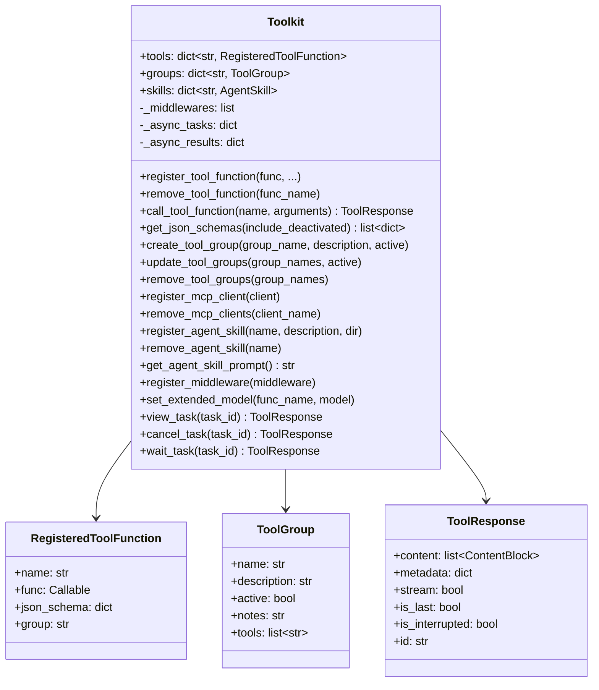
```mermaid
classDiagram
    class Toolkit {
        +tools: dict~str, RegisteredToolFunction~
        +groups: dict~str, ToolGroup~
        +skills: dict~str, AgentSkill~
        -_middlewares: list
        -_async_tasks: dict
        -_async_results: dict
        
        +register_tool_function(func, ...)
        +remove_tool_function(func_name)
        +call_tool_function(name, arguments) ToolResponse
        +get_json_schemas(include_deactivated) list~dict~
        
        +create_tool_group(group_name, description, active)
        +update_tool_groups(group_names, active)
        +remove_tool_groups(group_names)
        
        +register_mcp_client(client)
        +remove_mcp_clients(client_name)
        
        +register_agent_skill(name, description, dir)
        +remove_agent_skill(name)
        +get_agent_skill_prompt() str
        
        +register_middleware(middleware)
        +set_extended_model(func_name, model)
        
        +view_task(task_id) ToolResponse
        +cancel_task(task_id) ToolResponse
        +wait_task(task_id) ToolResponse
    }

    class ToolResponse {
        +content: list~ContentBlock~
        +metadata: dict
        +stream: bool
        +is_last: bool
        +is_interrupted: bool
        +id: str
    }

    class RegisteredToolFunction {
        +name: str
        +func: Callable
        +json_schema: dict
        +group: str
    }

    class ToolGroup {
        +name: str
        +description: str
        +active: bool
        +notes: str
        +tools: list~str~
    }

    Toolkit --> RegisteredToolFunction
    Toolkit --> ToolGroup
    Toolkit --> ToolResponse
```

### 9.2 工具调用流程

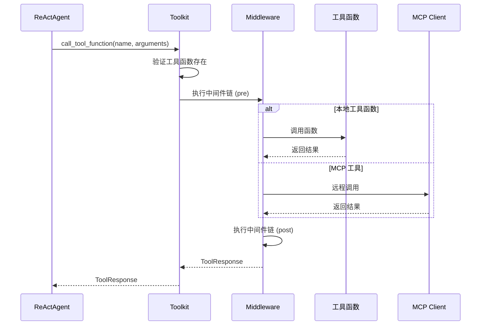
```mermaid
sequenceDiagram
    participant Agent as ReActAgent
    participant TK as Toolkit
    participant MW as Middleware
    participant Func as 工具函数
    participant MCP as MCP Client

    Agent->>TK: call_tool_function(name, arguments)
    
    TK->>TK: 验证工具函数存在
    TK->>MW: 执行中间件链 (pre)
    
    alt 本地工具函数
        MW->>Func: 调用函数
        Func-->>MW: 返回结果
    else MCP 工具
        MW->>MCP: 远程调用
        MCP-->>MW: 返回结果
    end
    
    MW->>MW: 执行中间件链 (post)
    MW-->>TK: ToolResponse
    TK-->>Agent: ToolResponse
```

### 9.3 工具分组与动态激活

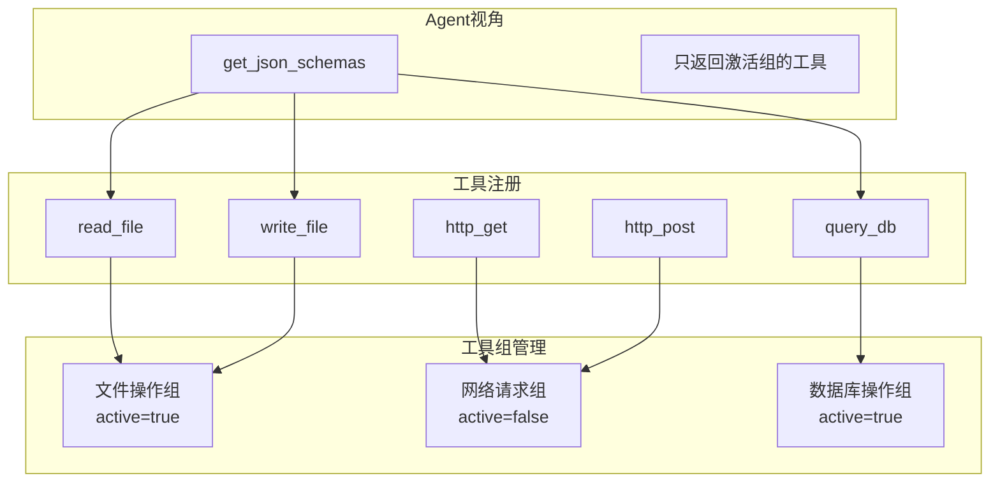
```mermaid
flowchart TD
    subgraph 工具组管理
        G1[文件操作组<br/>active=true]
        G2[网络请求组<br/>active=false]
        G3[数据库操作组<br/>active=true]
    end

    subgraph 工具注册
        T1[read_file] --> G1
        T2[write_file] --> G1
        T3[http_get] --> G2
        T4[http_post] --> G2
        T5[query_db] --> G3
    end

    subgraph Agent视角
        SCHEMA[get_json_schemas]
        SCHEMA --> T1 & T2 & T5
        note1[只返回激活组的工具]
    end
```

**关键特性**：
- **中间件系统**：支持在工具执行前后插入自定义逻辑（日志、权限检查、结果转换等）
- **异步后台执行**：工具可在后台异步执行，Agent 可通过 `view_task`/`wait_task`/`cancel_task` 管理
- **MCP 集成**：直接注册 MCP 客户端的工具，支持 HTTP 和 stdio 两种传输方式
- **Agent Skill**：从目录加载技能，每个技能包含 `SKILL.md` 描述文件
- **扩展模型**：为特定工具函数设置专用的 Pydantic BaseModel 扩展 JSON Schema

### 9.4 MCP 客户端集成

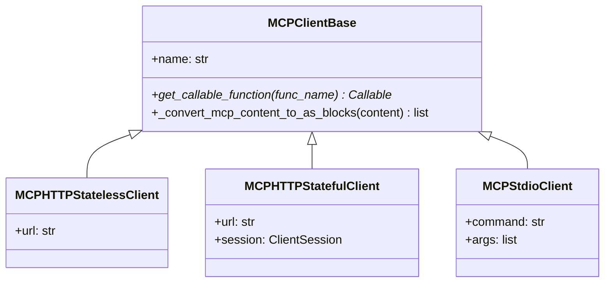
```mermaid
classDiagram
    class MCPClientBase {
        +name: str
        +get_callable_function(func_name)* Callable
        +_convert_mcp_content_to_as_blocks(content) list
    }

    class MCPHTTPStatelessClient {
        +url: str
    }

    class MCPHTTPStatefulClient {
        +url: str
        +session: ClientSession
    }

    class MCPStdioClient {
        +command: str
        +args: list
    }

    MCPClientBase <|-- MCPHTTPStatelessClient
    MCPClientBase <|-- MCPHTTPStatefulClient
    MCPClientBase <|-- MCPStdioClient
```

---

## 10. Pipeline 与多智能体编排

### 10.1 Pipeline 类型

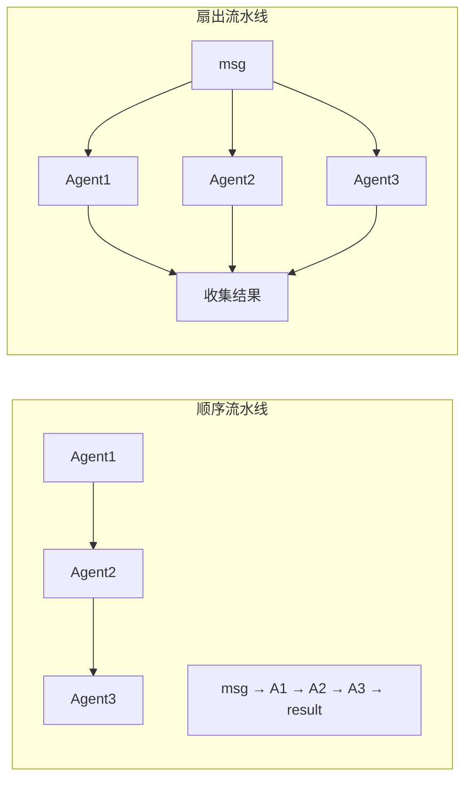
```mermaid
graph LR
    subgraph Sequential["顺序流水线"]
        A1[Agent1] --> A2[Agent2] --> A3[Agent3]
        note1["msg → A1 → A2 → A3 → result"]
    end

    subgraph Fanout["扇出流水线"]
        MSG[msg] --> B1[Agent1]
        MSG --> B2[Agent2]
        MSG --> B3[Agent3]
        B1 & B2 & B3 --> GATHER[收集结果]
    end
```

```python
# 顺序执行
result = await sequential_pipeline([agent1, agent2, agent3], msg)

# 并行扇出
results = await fanout_pipeline([agent1, agent2, agent3], msg)
```

### 10.2 MsgHub — 消息广播中心

MsgHub 是多智能体通信的核心组件，实现了发布-订阅模式的消息广播。

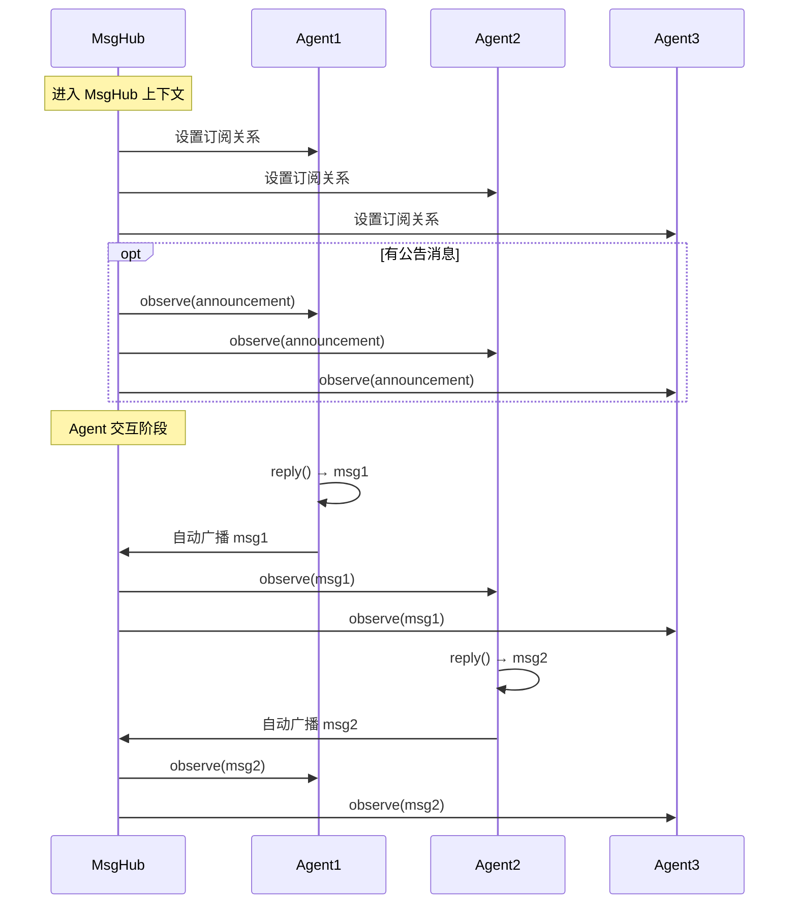
```mermaid
sequenceDiagram
    participant Hub as MsgHub
    participant A1 as Agent1
    participant A2 as Agent2
    participant A3 as Agent3

    Note over Hub: 进入 MsgHub 上下文
    Hub->>A1: 设置订阅关系
    Hub->>A2: 设置订阅关系
    Hub->>A3: 设置订阅关系
    
    opt 有公告消息
        Hub->>A1: observe(announcement)
        Hub->>A2: observe(announcement)
        Hub->>A3: observe(announcement)
    end

    Note over Hub: Agent 交互阶段
    A1->>A1: reply() → msg1
    A1->>Hub: 自动广播 msg1
    Hub->>A2: observe(msg1)
    Hub->>A3: observe(msg1)

    A2->>A2: reply() → msg2
    A2->>Hub: 自动广播 msg2
    Hub->>A1: observe(msg2)
    Hub->>A3: observe(msg2)
```

```python
# 使用示例 — 多智能体辩论
async with MsgHub(participants=[agent1, agent2, agent3], 
                  announcement=topic_msg):
    for _ in range(rounds):
        await agent1()
        await agent2()
        await agent3()
```

### 10.3 ChatRoom — 实时聊天室

ChatRoom 专为实时语音场景设计，管理多个 RealtimeAgent 之间的消息转发。

```mermaid
flowchart TD
    FRONTEND[前端] -->|ClientEvent| QUEUE[共享队列]
    QUEUE --> FORWARD[转发循环]
    
    FORWARD -->|ClientEvent| AG1[RealtimeAgent 1]
    FORWARD -->|ClientEvent| AG2[RealtimeAgent 2]
    
    AG1 -->|ServerEvent| QUEUE
    AG2 -->|ServerEvent| QUEUE
    
    FORWARD -->|ServerEvent| OUT[输出队列 → 前端]
    FORWARD -->|ServerEvent 广播| AG1
    FORWARD -->|ServerEvent 广播| AG2
```

---

## 11. RAG 检索增强生成

### 11.1 RAG 架构

```mermaid
graph TB
    subgraph 文档处理["📄 文档处理"]
        TR[TextReader]
        PR[PDFReader]
        WR[WordReader]
        PPR[PowerPointReader]
        ER[ExcelReader]
        IR[ImageReader]
    end

    subgraph 知识库["📚 知识库"]
        KB[KnowledgeBase]
        SKB[SimpleKnowledge]
    end

    subgraph 向量存储["💿 向量数据库"]
        QD[Qdrant]
        MV[Milvus]
        MG[MongoDB]
        MY[MySQL]
        OB[OceanBase]
    end

    subgraph 嵌入模型["🔢 嵌入模型"]
        OAI_E[OpenAI Embedding]
        DS_E[DashScope Embedding]
        DS_MM[DashScope 多模态 Embedding]
        GM_E[Gemini Embedding]
        OL_E[Ollama Embedding]
    end

    TR & PR & WR & PPR & ER & IR -->|Document| KB
    KB -->|文本| OAI_E & DS_E & DS_MM & GM_E & OL_E
    OAI_E & DS_E & DS_MM & GM_E & OL_E -->|向量| QD & MV & MG & MY & OB
    KB -->|retrieve_knowledge| AGENT[ReActAgent]
```

### 11.2 RAG 检索流程

```mermaid
sequenceDiagram
    participant Agent as ReActAgent
    participant KB as KnowledgeBase
    participant EMB as EmbeddingModel
    participant Cache as EmbeddingCache
    participant VDB as VectorDB

    Agent->>KB: retrieve_knowledge(query)
    KB->>EMB: embed(query)
    
    alt 缓存命中
        EMB->>Cache: retrieve(query)
        Cache-->>EMB: cached_vector
    else 缓存未命中
        EMB->>EMB: 调用API生成向量
        EMB->>Cache: store(query, vector)
    end
    
    EMB-->>KB: query_vector
    KB->>VDB: search(query_vector, limit, threshold)
    VDB-->>KB: list[Document]
    KB->>KB: 格式化为 ToolResponse
    KB-->>Agent: ToolResponse
```

### 11.3 Document 模型

```python
class Document:
    content: str          # 文档内容
    metadata: dict        # 元数据（来源、页码等）
    embedding: list[float] | None  # 向量表示
    score: float | None   # 检索相关性分数
```

### 11.4 Embedding 缓存

```mermaid
classDiagram
    class EmbeddingCacheBase {
        +store(key, embedding)*
        +retrieve(key)* list~float~ | None
        +remove(key)*
        +clear()*
    }

    class FileEmbeddingCache {
        +cache_dir: str
        -_index: dict
    }

    EmbeddingCacheBase <|-- FileEmbeddingCache
```

---

## 12. 实时语音交互 (Realtime)

### 12.1 实时模型架构

```mermaid
classDiagram
    class RealtimeModelBase {
        +model_name: str
        +websocket_url: str
        +websocket_headers: dict
        +input_sample_rate: int
        +output_sample_rate: int
        -_incoming_queue: Queue
        -_websocket: ClientConnection
        
        +send(data)* 
        +connect(outgoing_queue, instructions, tools)
        +_build_session_config()*
    }

    class OpenAIRealtimeModel {
        +api_key: str
    }

    class DashScopeRealtimeModel {
        +api_key: str
    }

    class GeminiRealtimeModel {
        +api_key: str
    }

    RealtimeModelBase <|-- OpenAIRealtimeModel
    RealtimeModelBase <|-- DashScopeRealtimeModel
    RealtimeModelBase <|-- GeminiRealtimeModel
```

### 12.2 实时交互事件系统

```mermaid
graph TB
    subgraph ClientEvents["客户端事件"]
        CSC[SessionCreate]
        CSE[SessionEnd]
        CAI[AudioInput]
        CTI[TextInput]
        CII[ImageInput]
        CTR[ToolResult]
        CIC[InterruptConversation]
    end

    subgraph ServerEvents["服务端事件"]
        SSC[SessionCreated]
        SSE[SessionEnded]
        SAO[AudioOutput]
        STO[TextOutput]
        STC[ToolCall]
        STD[TurnDone]
    end

    subgraph ModelEvents["模型事件"]
        MSC[SessionCreated]
        MSE[SessionEnded]
        MAO[AudioOutput]
        MTO[TextOutput]
        MTC[ToolCall]
        MTD[TurnDone]
    end

    ClientEvents -->|WebSocket| ModelEvents
    ModelEvents -->|转换| ServerEvents
```

### 12.3 RealtimeAgent 工作流

```mermaid
sequenceDiagram
    participant FE as 前端
    participant RA as RealtimeAgent
    participant Model as RealtimeModel
    participant Tool as Toolkit
    participant Queue as 消息队列

    FE->>RA: start(outgoing_queue)
    RA->>Model: connect(queue, instructions, tools)
    
    par 转发循环
        loop 持续监听
            FE->>Queue: ClientEvent (音频/文本)
            Queue->>RA: _forward_loop()
            RA->>Model: send(data)
        end
    and 模型响应循环
        loop 持续监听
            Model->>RA: _model_response_loop()
            alt 音频/文本输出
                RA->>Queue: ServerEvent
                Queue->>FE: 推送到前端
            else 工具调用
                RA->>Tool: _acting(tool_calls)
                Tool-->>RA: ToolResponse
                RA->>Model: send(ToolResult)
            end
        end
    end
```

---

## 13. TTS 语音合成

### 13.1 TTS 模型体系

```mermaid
classDiagram
    class TTSModelBase {
        +model_name: str
        +stream: bool
        +connect()
        +close()
        +synthesize(text)* AsyncGenerator~TTSResponse~
        +push(msg)
    }

    class OpenAITTSModel
    class DashScopeTTSModel
    class DashScopeCosyVoiceTTSModel
    class GeminiTTSModel
    
    class DashScopeRealtimeTTSModel {
        +connect()
        +push(text)
    }
    class DashScopeCosyVoiceRealtimeTTSModel

    TTSModelBase <|-- OpenAITTSModel
    TTSModelBase <|-- DashScopeTTSModel
    TTSModelBase <|-- DashScopeCosyVoiceTTSModel
    TTSModelBase <|-- GeminiTTSModel
    TTSModelBase <|-- DashScopeRealtimeTTSModel
    TTSModelBase <|-- DashScopeCosyVoiceRealtimeTTSModel

    class TTSResponse {
        +audio_data: bytes
        +sample_rate: int
        +usage: TTSUsage
        +stream: bool
    }
```

**两种模式**：
- **批量合成**：`synthesize(text)` — 一次性合成完整音频
- **实时流式**：`connect()` + `push(text)` — 建立 WebSocket 连接，逐段推送文本

---

## 14. A2A 协议支持

### 14.1 A2A 架构

A2A (Agent-to-Agent) 协议支持 AgentScope Agent 与外部 Agent 的跨框架通信。

```mermaid
graph LR
    subgraph AgentScope
        A2A_AG[A2AAgent]
        RESOLVER[CardResolver]
    end

    subgraph 外部Agent
        REMOTE[远程 Agent]
        CARD[Agent Card]
    end

    subgraph 解析器
        FILE_R[FileResolver<br/>本地文件]
        NACOS_R[NacosResolver<br/>Nacos注册中心]
        WK_R[WellKnownResolver<br/>.well-known/agent.json]
    end

    RESOLVER --> FILE_R & NACOS_R & WK_R
    FILE_R & NACOS_R & WK_R -->|AgentCard| A2A_AG
    A2A_AG -->|A2A Protocol| REMOTE
    REMOTE -->|AgentCard| CARD
```

### 14.2 A2A 通信流程

```mermaid
sequenceDiagram
    participant Local as 本地 Agent
    participant A2A as A2AAgent
    participant Resolver as CardResolver
    participant Remote as 远程 Agent

    Local->>A2A: reply(msg)
    A2A->>Resolver: get_agent_card()
    Resolver-->>A2A: AgentCard (URL, capabilities)
    A2A->>A2A: 转换 Msg → A2A Message
    A2A->>Remote: HTTP/SSE 请求
    
    alt 流式响应
        loop
            Remote-->>A2A: Task Update (streaming)
            A2A->>A2A: 转换 A2A → Msg
        end
    else 轮询
        A2A->>Remote: 查询任务状态
        Remote-->>A2A: Task Result
    end
    
    A2A-->>Local: Msg
```

---

## 15. 规划系统 (Plan)

### 15.1 规划模型

```mermaid
classDiagram
    class Plan {
        +id: str
        +name: str
        +description: str
        +sub_tasks: list~SubTask~
        +state: "todo" | "in_progress" | "done" | "abandoned"
        +created_at: str
        +to_markdown() str
    }

    class SubTask {
        +name: str
        +description: str
        +expected_outcome: str
        +outcome: str
        +state: "todo" | "in_progress" | "done" | "abandoned"
        +finish(outcome)
        +to_markdown() str
    }

    class PlanNotebook {
        +storage: PlanStorageBase
        +create_plan(name, description, sub_tasks)
        +update_plan(plan_id, ...)
        +get_plans()
    }

    class PlanStorageBase {
        +add_plan(plan)*
        +delete_plan(plan_id)*
        +get_plans()* list~Plan~
        +get_plan(plan_id)* Plan
    }

    class InMemoryPlanStorage

    Plan --> SubTask : 包含
    PlanNotebook --> PlanStorageBase
    PlanStorageBase <|-- InMemoryPlanStorage
```

**规划流程**：Agent 可以创建计划、分解子任务、跟踪执行状态，并将计划状态作为上下文提示注入到后续推理中。

---

## 16. 评估框架 (Evaluate)

### 16.1 评估体系

```mermaid
classDiagram
    class BenchmarkBase {
        +name: str
        +description: str
        +__iter__()* Generator~Task~
        +__len__()* int
        +__getitem__(index)* Task
    }

    class Task {
        +id: str
        +input: dict
        +expected: dict
        +metadata: dict
    }

    class Solution {
        +task_id: str
        +output: dict
    }

    class MetricBase {
        +__call__(task, solution)* float
    }

    class ACEBenchmark {
        +data_path: str
        +_load_data() list~dict~
        +_verify_data() bool
        +_download_data()
    }

    class ACEProcessAccuracy
    class ACEAccuracy

    BenchmarkBase <|-- ACEBenchmark
    MetricBase <|-- ACEProcessAccuracy
    MetricBase <|-- ACEAccuracy
    BenchmarkBase --> Task
```

**ACEBench** 是内置的 Agent 能力评估基准，包含：
- 食品平台 API 操作
- 消息系统操作
- 提醒系统操作
- 旅行预订操作
- 支持中英文双语评估

---

## 17. 模型微调 (Tuner)

### 17.1 微调架构

```mermaid
graph TB
    subgraph 配置层["⚙️ 配置"]
        MC[TunerModelConfig<br/>模型配置]
        DC[DatasetConfig<br/>数据集配置]
        AC[AlgorithmConfig<br/>算法配置]
    end

    subgraph 工作流["🔄 工作流"]
        WF[WorkflowType<br/>自定义训练流程]
        JF[JudgeType<br/>自定义评估函数]
    end

    subgraph Trinity-RFT["🔧 Trinity-RFT 引擎"]
        EXPLORER[Explorer<br/>数据探索]
        TRAINER[Trainer<br/>模型训练]
        EVALUATOR[Evaluator<br/>模型评估]
    end

    MC & DC & AC --> CONVERT[_to_trinity_config]
    WF & JF --> CONVERT
    CONVERT --> Trinity-RFT
```

**核心概念**：
- **Agentic RL**：通过 Agent 工作流生成训练数据，用强化学习微调模型
- **WorkflowType**：定义 Agent 如何与环境交互生成训练轨迹
- **JudgeType**：定义如何评估 Agent 的输出质量
- 底层使用 Trinity-RFT 库实现分布式训练

---

## 18. 会话与状态管理 (Session & State)

### 18.1 会话持久化

```mermaid
classDiagram
    class SessionBase {
        +save_session_state(session_id, user_id, **modules)*
        +load_session_state(session_id, user_id, **modules)*
    }

    class JSONSession {
        +save_dir: str
    }

    class RedisSession {
        +host: str
        +port: int
    }

    class TablestoreSession {
        +endpoint: str
        +instance_name: str
    }

    SessionBase <|-- JSONSession
    SessionBase <|-- RedisSession
    SessionBase <|-- TablestoreSession
```

### 18.2 状态保存与恢复流程

```mermaid
sequenceDiagram
    participant App as 应用
    participant Session as SessionBase
    participant Agent as AgentBase
    participant Memory as MemoryBase
    participant Toolkit as Toolkit

    Note over App: 保存会话
    App->>Session: save_session_state(session_id, agent=agent, memory=memory)
    Session->>Agent: state_dict()
    Agent->>Memory: state_dict()
    Agent->>Toolkit: state_dict()
    Session->>Session: 序列化并持久化

    Note over App: 恢复会话
    App->>Session: load_session_state(session_id, agent=agent, memory=memory)
    Session->>Session: 读取并反序列化
    Session->>Agent: load_state_dict(state)
    Agent->>Memory: load_state_dict(state)
    Agent->>Toolkit: load_state_dict(state)
```

**StateModule 的嵌套状态管理**是这一切的基础：当 Agent 包含 Memory、Toolkit 等子模块时，`state_dict()` 会递归收集所有子模块的状态，`load_state_dict()` 会递归恢复。

---

## 19. 可观测性与追踪 (Tracing)

### 19.1 OpenTelemetry 集成

```mermaid
graph LR
    subgraph AgentScope
        AGENT[Agent] --> MODEL[Model]
        MODEL --> TRACE[Tracing 装饰器]
        TRACE --> SPAN[创建 Span]
    end

    subgraph OpenTelemetry
        SPAN --> PROCESSOR[BatchSpanProcessor]
        PROCESSOR --> EXPORTER[OTLPSpanExporter]
    end

    subgraph 后端
        EXPORTER --> JAEGER[Jaeger]
        EXPORTER --> GRAFANA[Grafana Tempo]
        EXPORTER --> OTHER[其他 OTLP 后端]
    end
```

### 19.2 追踪属性

```python
class SpanAttributes:
    # 通用属性
    GEN_AI_SYSTEM = "gen_ai.system"
    GEN_AI_OPERATION_NAME = "gen_ai.operation.name"
    
    # 请求属性
    GEN_AI_REQUEST_MODEL = "gen_ai.request.model"
    GEN_AI_REQUEST_TEMPERATURE = "gen_ai.request.temperature"
    GEN_AI_REQUEST_MAX_TOKENS = "gen_ai.request.max_tokens"
    
    # 响应属性
    GEN_AI_RESPONSE_MODEL = "gen_ai.response.model"
    GEN_AI_USAGE_INPUT_TOKENS = "gen_ai.usage.input_tokens"
    GEN_AI_USAGE_OUTPUT_TOKENS = "gen_ai.usage.output_tokens"
    
    # 工具属性
    GEN_AI_TOOL_NAME = "gen_ai.tool.name"
    GEN_AI_TOOL_CALL_ID = "gen_ai.tool.call.id"
```

遵循 OpenTelemetry 语义约定，确保与标准可观测性工具链的兼容性。

---

## 20. Embedding 向量化

### 20.1 Embedding 模型体系

```mermaid
classDiagram
    class EmbeddingModelBase {
        +model_name: str
        +dimensions: int
        +__call__(*args) EmbeddingResponse
    }

    class OpenAITextEmbedding
    class DashScopeTextEmbedding
    class DashScopeMultiModalEmbedding {
        +supported_modalities: ["text", "image"]
    }
    class GeminiTextEmbedding
    class OllamaTextEmbedding

    EmbeddingModelBase <|-- OpenAITextEmbedding
    EmbeddingModelBase <|-- DashScopeTextEmbedding
    EmbeddingModelBase <|-- DashScopeMultiModalEmbedding
    EmbeddingModelBase <|-- GeminiTextEmbedding
    EmbeddingModelBase <|-- OllamaTextEmbedding

    class EmbeddingResponse {
        +embeddings: list~list~float~~
        +usage: EmbeddingUsage
    }

    class EmbeddingCacheBase {
        +store(key, embedding)
        +retrieve(key)
        +remove(key)
        +clear()
    }

    class FileEmbeddingCache

    EmbeddingCacheBase <|-- FileEmbeddingCache
```

**亮点**：DashScope 多模态 Embedding 支持文本和图片的联合向量化，适用于多模态 RAG 场景。

---

## 21. 关键设计模式总结

### 21.1 设计模式一览

```mermaid
graph LR
    ROOT((AgentScope<br/>设计模式))

    ROOT --- P1[抽象工厂]
    P1 --- P1A[ChatModelBase → 多种模型实现]
    P1 --- P1B[FormatterBase → 多种格式化器]
    P1 --- P1C[MemoryBase → 多种存储后端]

    ROOT --- P2[策略模式]
    P2 --- P2A[Formatter 策略]
    P2 --- P2B[TokenCounter 策略]
    P2 --- P2C[EmbeddingCache 策略]

    ROOT --- P3[观察者模式]
    P3 --- P3A[MsgHub 发布-订阅]
    P3 --- P3B[Agent 订阅者机制]
    P3 --- P3C[Hook 系统]

    ROOT --- P4[装饰器模式]
    P4 --- P4A[Tracing 装饰器]
    P4 --- P4B[Middleware 中间件链]

    ROOT --- P5[状态模式]
    P5 --- P5A[StateModule 状态管理]
    P5 --- P5B[Plan/SubTask 状态机]

    ROOT --- P6[模板方法]
    P6 --- P6A["AgentBase.reply()"]
    P6 --- P6B["ReActAgentBase._reasoning()/_acting()"]

    ROOT --- P7[组合模式]
    P7 --- P7A[StateModule 嵌套]
    P7 --- P7B[Pipeline 组合]
```

### 21.2 核心设计原则

| 原则 | 体现 |
|------|------|
| **异步优先** | 全框架 async/await，所有核心接口均为异步 |
| **插件化架构** | 模型、记忆、存储、格式化器均可替换 |
| **关注点分离** | Agent 不直接依赖具体模型 API，通过 Formatter 解耦 |
| **状态可序列化** | StateModule 确保所有组件状态可保存/恢复 |
| **消息驱动** | Msg 作为唯一通信单元，统一多模态内容 |
| **Hook 可扩展** | 不修改核心代码即可注入自定义逻辑 |
| **ContextVar 隔离** | 全局配置使用 ContextVar，支持并发安全 |

### 21.3 与其他框架对比

```mermaid
graph TB
    subgraph AgentScope特色
        AS1[异步原生设计]
        AS2[StateModule 状态管理]
        AS3[内置模型微调]
        AS4[实时语音交互]
        AS5[MCP + A2A 双协议]
        AS6[记忆压缩机制]
        AS7[工具分组与动态激活]
    end

    subgraph 对比LangChain
        LC1[Chain 编排 vs Pipeline]
        LC2[Memory 抽象类似]
        LC3[AgentScope 更轻量]
        LC4[AgentScope 异步原生]
    end

    subgraph 对比AutoGen
        AG1[多Agent通信类似]
        AG2[MsgHub vs GroupChat]
        AG3[AgentScope Hook更灵活]
        AG4[AgentScope 生产部署更完善]
    end
```

---

## 22. 学习路径与掌握指南

### 22.1 推荐学习路线图

```mermaid
graph TD
    L1[第一阶段: 基础入门<br/>1-2周] --> L2[第二阶段: 核心模块<br/>2-3周]
    L2 --> L3[第三阶段: 高级特性<br/>2-3周]
    L3 --> L4[第四阶段: 生产实践<br/>2-4周]
    L4 --> L5[第五阶段: 源码精读<br/>持续]

    L1 --> L1A[安装与环境配置]
    L1 --> L1B[运行 Hello AgentScope 示例]
    L1 --> L1C[理解 Msg 消息模型]
    L1 --> L1D[创建第一个 ReActAgent]

    L2 --> L2A[深入 Agent 生命周期]
    L2 --> L2B[掌握 Model + Formatter]
    L2 --> L2C[工具注册与调用]
    L2 --> L2D[Memory 工作记忆]

    L3 --> L3A[MsgHub 多Agent编排]
    L3 --> L3B[RAG 知识检索]
    L3 --> L3C[MCP 协议集成]
    L3 --> L3D[Hook 系统定制]
    L3 --> L3E[实时语音交互]

    L4 --> L4A[Session 会话持久化]
    L4 --> L4B[OpenTelemetry 追踪]
    L4 --> L4C[K8s 部署]
    L4 --> L4D[模型微调 Tuner]
    L4 --> L4E[评估框架使用]

    L5 --> L5A[StateModule 源码]
    L5 --> L5B[AgentBase 元类机制]
    L5 --> L5C[Toolkit 中间件链]
    L5 --> L5D[RealtimeModel 事件系统]
```

### 22.2 各阶段详细指南

#### 第一阶段：基础入门（1-2周）

1. **环境搭建**
   - 安装 Python 3.10+，`pip install agentscope`
   - 配置至少一个 LLM API Key（推荐 OpenAI 或 DashScope）

2. **核心概念理解**
   - 阅读 README 和官方教程 https://doc.agentscope.io/
   - 重点理解：Msg、Agent、Model 三者的关系
   - 运行 `examples/agent/react_agent` 示例

3. **动手实践**
   - 创建一个简单的问答 Agent
   - 尝试不同的模型后端（OpenAI、Ollama 等）
   - 理解 `reply()` 方法的输入输出

#### 第二阶段：核心模块（2-3周）

1. **Agent 深入**
   - 阅读 `_agent_base.py` 和 `_react_agent.py` 源码
   - 理解 Hook 系统的注册和执行机制
   - 实现一个自定义 Agent

2. **Model + Formatter**
   - 理解 ChatModelBase 的抽象接口
   - 对比不同 Formatter 的实现差异
   - 理解流式输出的处理方式

3. **工具系统**
   - 注册自定义工具函数
   - 理解 JSON Schema 自动生成机制
   - 使用工具分组管理

4. **记忆系统**
   - 使用 InMemoryMemory 和 RedisMemory
   - 理解 mark 标记机制
   - 实现记忆压缩

#### 第三阶段：高级特性（2-3周）

1. **多Agent编排**
   - 使用 MsgHub 实现多Agent辩论
   - 使用 Pipeline 实现顺序/并行工作流
   - 理解订阅者机制

2. **RAG 集成**
   - 搭建知识库（选择一个向量数据库）
   - 实现文档解析和检索
   - 集成到 ReActAgent

3. **MCP 协议**
   - 连接外部 MCP Server
   - 理解 MCP 工具的注册流程

4. **实时语音**
   - 运行实时语音示例
   - 理解 WebSocket 事件模型
   - 实现多Agent实时聊天室

#### 第四阶段：生产实践（2-4周）

1. **会话管理**
   - 实现 Session 持久化（Redis/JSON）
   - 理解 StateModule 的嵌套序列化

2. **可观测性**
   - 配置 OpenTelemetry 追踪
   - 接入 Jaeger 或 Grafana

3. **部署**
   - 本地部署
   - Docker/K8s 部署（参考 agentscope-runtime）

4. **评估与微调**
   - 使用 ACEBench 评估 Agent
   - 尝试 Trinity-RFT 微调

#### 第五阶段：源码精读（持续）

重点阅读顺序：
1. `module/_state_module.py` — 理解状态管理基石
2. `message/_message_base.py` — 理解消息模型
3. `agent/_agent_base.py` + `_agent_meta.py` — 理解元类和 Hook 注入
4. `agent/_react_agent.py` — 理解 ReAct 循环
5. `tool/_toolkit.py` — 理解工具管理和中间件
6. `pipeline/_msghub.py` — 理解多Agent通信
7. `memory/` — 理解记忆抽象和实现
8. `realtime/` — 理解实时事件系统

---

## 23. 面试准备指南

### 23.1 基础概念题

**Q1: AgentScope 的核心设计理念是什么？与 LangChain 有何不同？**

> AgentScope 的核心理念是"为日益强大的 Agentic LLM 而设计"，利用模型自身的推理和工具使用能力，而非用严格的 prompt 和固定编排来约束。与 LangChain 相比：
> - AgentScope 是异步原生设计（全 async/await），LangChain 后期才加入异步支持
> - AgentScope 的 StateModule 提供了类似 PyTorch nn.Module 的嵌套状态管理
> - AgentScope 内置模型微调（Trinity-RFT）和评估框架
> - AgentScope 更轻量，核心抽象更少但更精炼

**Q2: 解释 AgentScope 中 Msg 的设计，为什么 content 同时支持 str 和 list[ContentBlock]？**

> 这是为了兼顾简单场景和多模态场景。纯文本对话只需 `str`，而涉及图片、音频、工具调用时需要结构化的 ContentBlock 列表。这种设计避免了简单场景的过度抽象，同时保持了多模态的完整支持。

**Q3: StateModule 的设计灵感来自哪里？它解决了什么问题？**

> 灵感来自 PyTorch 的 `nn.Module`。它解决了 Agent 系统中状态持久化的问题：Agent 包含 Memory、Toolkit 等子模块，每个子模块又可能包含更深层的状态。StateModule 通过 `__setattr__` 自动追踪子模块，`register_state` 注册普通属性，实现了递归的 `state_dict()`/`load_state_dict()`。

### 23.2 架构设计题

**Q4: 如何设计一个支持多种 LLM API 的统一调用层？AgentScope 是怎么做的？**

> AgentScope 采用了两层抽象：
> 1. **ChatModelBase**：统一的模型调用接口，`__call__` 返回 `ChatResponse`
> 2. **FormatterBase**：将框架内部的 `Msg` 转换为各 API 特定的格式
>
> 这种分离使得添加新模型只需实现两个类，而 Agent 层完全不感知底层 API 差异。

**Q5: AgentScope 的 Hook 系统是如何实现的？为什么要区分类级别和实例级别？**

> Hook 通过 `_AgentMeta` 元类在类创建时自动包装 `reply`、`observe`、`print` 等方法。类级别 Hook 影响所有实例（如全局日志），实例级别 Hook 只影响单个 Agent（如特定 Agent 的权限检查）。执行顺序是类级别 → 实例级别，每个 Hook 可以修改输入参数或输出结果。

**Q6: MsgHub 如何实现多Agent间的消息广播？与直接调用 observe 有什么区别？**

> MsgHub 通过上下文管理器（`async with`）自动设置所有参与者的订阅关系。当任何 Agent 调用 `reply()` 后，其输出会自动广播给所有其他参与者的 `observe()` 方法。相比手动调用 observe，MsgHub 大幅简化了 N 对 N 的通信代码，从 O(N²) 的手动调用降为 O(1) 的声明式配置。

### 23.3 深度技术题

**Q7: AgentScope 如何实现记忆压缩？压缩策略是什么？**

> ReActAgent 的 `CompressionConfig` 定义了压缩策略：
> 1. 使用 TokenCounter 监控记忆中的 token 总量
> 2. 当超过 `trigger_threshold` 时触发压缩
> 3. 保留最近 `keep_recent` 条消息不压缩
> 4. 将旧消息通过 `compression_prompt` 发送给模型（可以是专用压缩模型）
> 5. 模型生成结构化摘要（包含任务概述、当前状态、重要发现、下一步、需保留上下文）
> 6. 用摘要替换旧消息

**Q8: Toolkit 的中间件系统是如何工作的？**

> Toolkit 的中间件采用洋葱模型：
> ```
> middleware1_pre → middleware2_pre → 实际工具执行 → middleware2_post → middleware1_post
> ```
> 每个中间件接收工具名、参数和 `next` 函数，可以在调用前修改参数、在调用后修改结果，或完全拦截调用。这类似于 Express.js 的中间件模式。

**Q9: AgentScope 的实时语音交互是如何实现的？事件系统的设计是什么？**

> 实时语音基于 WebSocket 长连接，采用事件驱动架构：
> - **ClientEvents**：前端发送的事件（音频输入、文本输入、中断等）
> - **ModelEvents**：模型返回的事件（音频输出、文本输出、工具调用等）
> - **ServerEvents**：转发给前端的事件
>
> RealtimeAgent 运行两个并发循环：`_forward_loop`（转发前端事件到模型）和 `_model_response_loop`（处理模型响应，包括工具调用和音频输出）。

**Q10: 为什么 AgentScope 使用 ContextVar 而不是全局变量来管理配置？**

> ContextVar 提供了线程安全和异步安全的隔离性。在多线程或多个 asyncio Task 并发执行时，每个执行上下文可以有独立的 run_id、project 等配置，互不干扰。这对于生产环境中同时处理多个用户请求至关重要。

### 23.4 系统设计题

**Q11: 如果让你设计一个支持 100 个 Agent 同时交互的系统，基于 AgentScope 你会怎么做？**

> 关键考虑：
> 1. **通信拓扑**：不能用全连接的 MsgHub（O(N²) 消息），需要设计分层或分组通信
> 2. **并发控制**：使用 `fanout_pipeline` 并行执行，但需要限制并发数避免 API 限流
> 3. **记忆管理**：每个 Agent 使用 Redis/SQLAlchemy 后端，避免内存溢出
> 4. **状态持久化**：使用 Session 定期保存状态，支持故障恢复
> 5. **可观测性**：配置 OpenTelemetry 追踪每个 Agent 的调用链
> 6. **部署**：使用 K8s 部署，每个 Agent 可独立扩缩容

**Q12: 如何为 AgentScope 添加一个新的模型提供商支持？**

> 需要实现三个组件：
> 1. **ChatModel**：继承 `ChatModelBase`，实现 `__call__` 方法，处理 API 调用和响应解析
> 2. **Formatter**：继承 `FormatterBase`，实现 `format` 方法，将 Msg 转换为该 API 的格式
> 3. **（可选）TokenCounter**：继承 `TokenCounterBase`，实现 token 计数逻辑
>
> 然后在 `__init__.py` 中注册导出即可。

### 23.5 开放性问题

**Q13: AgentScope 的 A2A 协议支持有什么局限性？如何改进？**

> 当前局限：
> - 仅支持 chatbot 场景（一个用户一个助手），不支持多角色
> - 不支持结构化输出
> - observed 消息在 reply 后清空，可能丢失上下文
>
> 改进方向：扩展 A2A 消息格式支持 name 字段、添加结构化输出协商机制、实现持久化的 observed 消息队列。

**Q14: 你认为 AgentScope 的 StateModule 设计有什么潜在问题？**

> 潜在问题：
> - 自定义序列化函数的正确性依赖开发者，没有类型检查
> - `strict=True` 时版本升级可能导致状态加载失败（新增字段）
> - 循环引用的 StateModule 会导致无限递归
>
> 改进建议：添加版本号机制、支持 schema migration、检测循环引用。

**Q15: 如果要将 AgentScope 应用于金融交易场景，你会关注哪些方面？**

> 关键关注点：
> 1. **安全性**：工具调用的权限控制（利用 Toolkit 中间件做鉴权）
> 2. **审计追踪**：利用 OpenTelemetry 记录所有决策和操作
> 3. **幂等性**：工具函数需要幂等设计，防止重复执行
> 4. **人机协作**：利用 ReActAgent 的实时引导功能，关键操作需人工确认
> 5. **状态一致性**：使用数据库后端的 Memory 和 Session，确保状态不丢失
> 6. **限流与熔断**：在 Toolkit 中间件中实现 API 限流和错误熔断

---

> **文档生成时间**: 2026年4月
> **基于版本**: AgentScope v1.0.19dev
> **数据来源**: 项目源码深度分析
